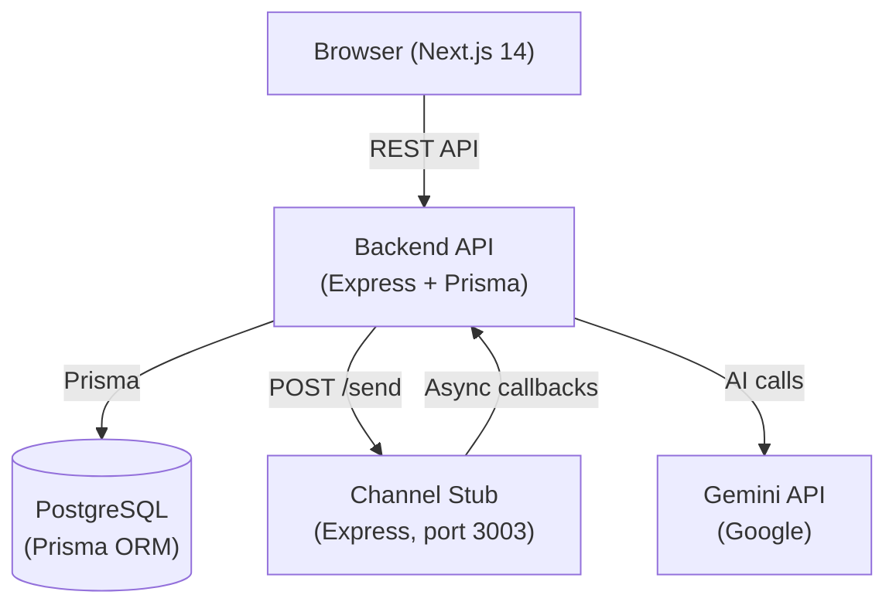

# Architecture — Brew & Co. AI Mini CRM

## System Overview

An AI-native Mini CRM for a coffee brand (Brew & Co.) that enables marketers to:
1. **Ingest** customer and order data (manual, CSV, or API)
2. **Segment** customers using natural language (AI converts to SQL)
3. **Send** personalised multi-channel campaigns (WhatsApp, SMS, Email)
4. **Analyse** campaign performance with AI-generated insights
5. **Act** on AI campaign recommendations with one-click execution

---

## Architecture Diagram



### Request Flow — Campaign Dispatch

```
1. Browser → POST /api/campaigns/:id/launch
2. Backend → queries DB for all segment customers
3. Backend → batches 50 at a time, sends to Channel Stub
4. Channel Stub → simulates delivery lifecycle (delivered → opened → clicked)
5. Channel Stub → POST /api/receipts/callback (async, per event)
6. Backend → updates Communication status in DB
7. Browser → polls /api/campaigns/:id/stats every 5s
```

### AI Integration Points

| Point | Function | Fallback |
|---|---|---|
| Segment Builder | NL → PostgreSQL via Gemini | Rule-based fallback (city/tier/spend regex) |
| Campaign Message | 3 personalized variants | Hardcoded brand templates |
| Campaign Insights | 2-3 sentence performance analysis | Template with actual numbers |
| Dashboard Recs | 3 structured campaign recommendations | Data-driven hardcoded recommendations |
| Quick Launch | AI drafts + creates + launches | Fallback message template |

---

## Technology Choices

| Technology | Version | Why |
|---|---|---|
| Next.js (App Router) | 14 | File-based routing, server components, excellent Vercel DX |
| Express.js | 4 | Lightweight, mature, full middleware control |
| Prisma | 5 | Type-safe ORM, auto-generated client, migrations |
| PostgreSQL | 15+ | Relational model fits CRM domain (customers → orders → campaigns) |
| Gemini API (gemini-1.5-flash) | latest | Best NL→SQL performance, structured output, generous free tier (1500 req/day) |
| TypeScript | 5 | End-to-end type safety across all 3 services |
| TailwindCSS | 3 | Rapid UI, utility-first, compatible with design token layer |
| Framer Motion | — | Micro-animations on cards and page transitions |
| Recharts | — | Declarative chart library for campaign timeline |

---

## Data Model

```
Store
 └── Customer (storeId FK)
      └── Order (customerId FK)

Store
 └── Segment (storeId FK)
      └── Campaign (segmentId FK, storeId FK)
           └── Communication (campaignId FK, customerId FK)
                └── Receipt (communicationId FK)
```

### Key relationships
- `Customer` ↔ `Order`: one-to-many, tracks purchase history and `totalSpend`
- `Segment`: stores a validated PostgreSQL `sqlQuery` that returns customer IDs
- `Campaign`: references a Segment; contains the `message`, `channel`, and dispatch `status`
- `Communication`: one row per customer per campaign; tracks delivery lifecycle (`queued → sent → delivered → opened → clicked → failed`)
- `Receipt`: one row per lifecycle event (e.g., delivered at 14:20, opened at 14:25)

---

## Channel Stub Design

The Channel Stub (`/channel-stub`) is a separate Express service that simulates third-party messaging providers (Twilio, Resend).

**Two modes:**
- **Simulate mode** (default): Accepts send requests, then fires async callbacks after random delays, simulating a realistic delivery funnel (delivery: ~85%, open: ~40%, click: ~25%)
- **Real mode** (env `SEND_MODE=real`): Actually sends via Twilio (WhatsApp/SMS) and EmailJS (email)

**Why a separate service?**
- Decouples the CRM from provider credentials
- Can be swapped for a real provider proxy with zero CRM changes
- Enables realistic end-to-end testing without API keys
- Matches real-world architecture where a webhook gateway sits between provider and CRM

---

## Scale Assumptions & Tradeoffs

| Decision | What I Did | What I'd Do at Scale |
|---|---|---|
| Dispatch queue | `void async IIFE` (non-blocking background loop) | BullMQ + Redis for retry, dead-letter, and progress tracking |
| Rate limiting | In-memory `Map<IP, {count, resetAt}>` | Redis-backed sliding window (survives restarts, works across instances) |
| Segment SQL | `$queryRawUnsafe` with validation layer | Parameterized query builder or materialized segment views |
| Stats polling | Client polls `/stats` every 5s | WebSocket or SSE for real-time push |
| Pagination | Server-side (25/page, configurable) | Cursor-based pagination for 1M+ rows |
| Multi-tenancy | `storeId` header scoping | Row-level security in PostgreSQL |
| AI calls | Direct Gemini API with fallback | Response caching with Redis (same query → cached result) |
| Testing | Unit tests + SQL safety tests | Integration tests with test DB, E2E with Playwright |

---

## Security Model

1. **SQL injection prevention**: Segment queries are validated before execution:
   - Stripped of forbidden tokens (`DELETE`, `DROP`, `INSERT`, `UPDATE`, `ALTER`, etc.)
   - Rejected if they contain SQL comments (`--`, `/* */`)
   - Rejected if they don't target `customers` as the base table
   - `storeId` validated as CUID format before interpolation (prevents header injection)

2. **Rate limiting**: 
   - AI endpoints: 20 req/min per IP
   - Global: 200 req/min per IP
   - Returns `429` with `Retry-After` header

3. **Request size**: Body parser limited to 1MB

4. **CORS**: Restricted to the frontend origin

5. **Multi-tenancy**: All data queries are scoped to `storeId` from the `x-store-id` header

---

## What I'd Add With More Time

- **BullMQ job queue** for campaign dispatch with retry, backoff, and dead-letter handling
- **WebSocket / SSE** for real-time campaign stats without polling
- **A/B testing**: Multiple message variants per campaign with split-send and automatic winner selection
- **Churn prediction**: ML model or rule-based scoring (days since last order + frequency + spend trend)
- **Audience overlap detection**: Warn when a customer appears in multiple active campaigns
- **Comprehensive integration tests**: Supertest API tests against a test PostgreSQL instance
- **CI/CD pipeline**: GitHub Actions → build + test → deploy to Railway/Vercel
- **Authentication**: NextAuth or Clerk for user login, store-level access control
